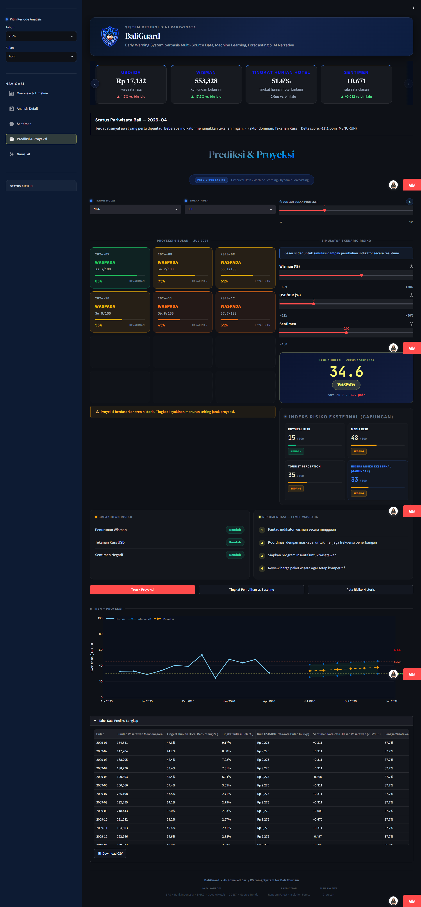
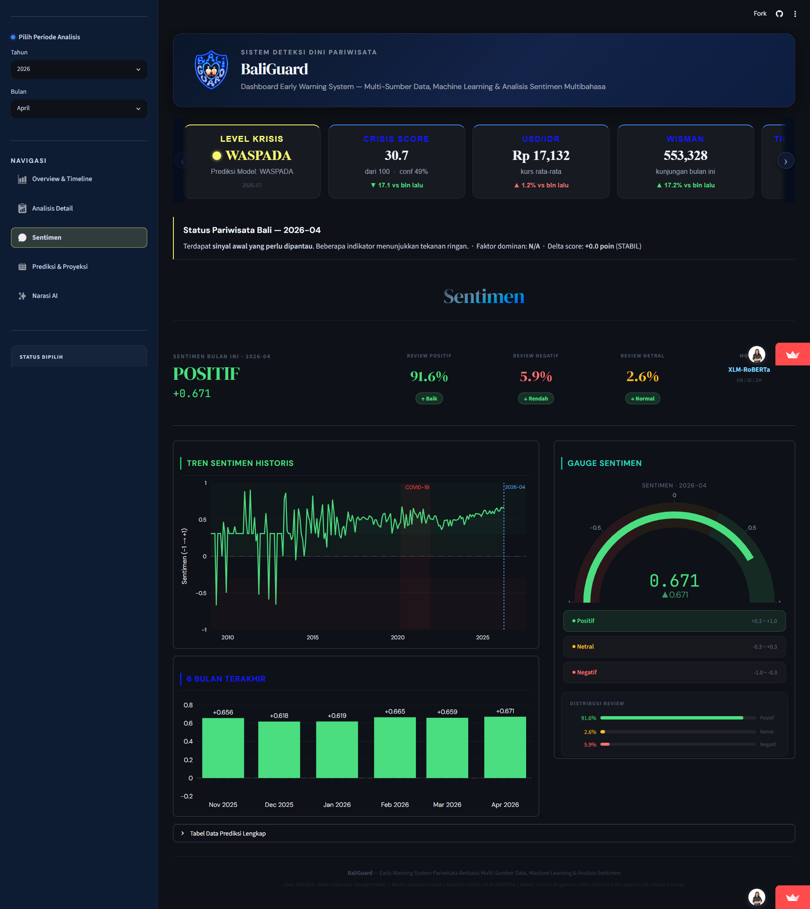
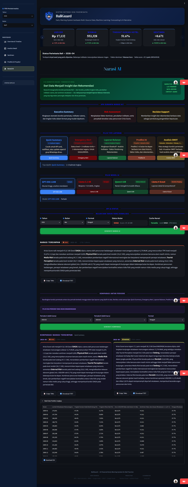

# BaliGuard

Early Warning System for Bali Tourism Crisis Monitoring, combining machine learning, multilingual sentiment analysis, and AI-generated narrative reporting.

## Live Demo

**[https://baliguard.streamlit.app](https://baliguard.streamlit.app)**

The dashboard is live and reads directly from Supabase, so it always reflects the latest predictions produced by the automation and ML pipeline layers.

## Overview

BaliGuard continuously monitors the health of Bali's tourism sector by combining tourism, economic, sentiment, and external risk indicators into a single composite Crisis Score (0-100). The score is mapped to four severity levels — AMAN, WASPADA, SIAGA, KRISIS — and served through an interactive Streamlit dashboard.

The system is composed of four layers: a scheduled automation layer that ingests external data, a machine learning pipeline that engineers features and produces predictions, a **prediction service layer** that turns stored predictions into forecasts and human-readable explanations, and a dashboard layer that renders all of it and generates AI narrative reports. Data is persisted end-to-end in Supabase, and the full pipeline runs on a schedule via GitHub Actions.

## Production Workflow

```
External Data
      |
      v
  Automation
      |
      v
Feature Engineering
      |
      v
Machine Learning
      |
      v
predictions_final.csv
      |
Upload to Supabase
      |
      v
Prediction Service Layer
  +----------+----------+
  |          |          |
Forecast  Delta    Explanation
  |       Context      |
  +----------+----------+
      |
      v
Streamlit Dashboard
      |
      v
  AI Narrative
```

Automation only fetches and stages external data. The ML pipeline reads staged data and never calls external APIs directly. Supabase remains the single source of truth for historical predictions. Within the Prediction Service Layer, Forecast first resolves the selected month's row (historical or projected), Delta Context then compares that row against the previous month, and Explanation consumes both to produce the panel text — the three are grouped together as one layer because none of them write back to Supabase, but Explanation depends on Delta Context's output rather than running fully in parallel. The dashboard itself only reads predictions and renders the output of these services. Each layer can be modified, tested, or re-run independently.

### Architecture Diagram

The diagram above shows the logical data flow. A rendered architecture diagram (PNG/SVG) is available under `reports/figures/` — see `architecture_diagram.png` for a visual overview of how the automation, ML pipeline, Supabase, and dashboard layers connect, including the GitHub Actions schedule that triggers each layer.

## Dashboard Features

The dashboard is organized into five pages, all driven by a shared context built from the latest predictions and metadata.

**Overview & Timeline**
Landing page with current crisis level, Crisis Score, USD/IDR rate, and tourist arrivals as KPI cards. Includes historical charts for tourist arrivals, exchange rate, and Crisis Score with level bands, an External Risk Monitor (Physical Risk, Media Risk, Tourist Perception), and a downloadable data table.

**Detailed Analysis**
Breaks the Crisis Score down into its contributing components (tourism, economic conditions, sentiment, external risk), shows the Random Forest class probability distribution, and ranks the features most influential to the current prediction. Includes a full indicator table with anomaly detection status.

**Sentiment Analysis**
Reports the aggregate sentiment classification for the selected month (positive, negative, neutral) based on multilingual review analysis, alongside a historical sentiment trend, a sentiment gauge, and a six-month comparison chart.

**Prediction & Projection**
Generates a configurable multi-month forecast (3 to 12 months) with a confidence level that decreases with projection distance, and a real-time scenario simulator that recalculates the Crisis Score as tourist arrivals, exchange rate, and sentiment inputs are adjusted. Includes a risk breakdown and level-specific recommendations.

**AI Narrative**
Converts the current data state into a ready-to-use Bahasa Indonesia report using an LLM. See below for details.

## AI Narrative

The AI Narrative page turns model outputs into structured, human-readable reports intended for internal briefings, early warning communication, and press material.

Report types:

- Quick Summary — a two to three sentence status update
- Emergency Alert — status, key indicators, and an immediate recommendation for SIAGA/KRISIS conditions
- Laporan Bulanan (Monthly Report) — executive summary, indicator analysis, driving factors, and recommendations
- Prediksi AI (AI Prediction) — three to six month outlook with scenario-based risk
- Analisis SWOT — strengths, weaknesses, opportunities, and threats based on the current data

Supported models, served via the Groq API: GPT-OSS 120B, Llama 3.1 8B, Qwen3 32B, and Llama 4 Scout, selectable per report for a trade-off between accuracy, speed, and narrative style.

Additional capabilities:

- Narrative caching per month, report type, model, and format, backed by Supabase, so previously generated reports are served without a repeated LLM call
- Multiple output formats (paragraph or bullet-point)
- Side-by-side comparison of narratives between two different periods for the same report type
- Copy-to-clipboard and TXT export for generated narratives

## Machine Learning

The pipeline builds a monthly time series from raw tourism, economic, sentiment, and external risk data and produces two model outputs per month.

- **Preprocessing and feature engineering** — growth rates, rolling statistics, z-scores, volatility, seasonality, and normalized external risk indicators
- **Crisis Score** — a weighted composite of tourism, economic, sentiment, and external risk components, with a pre-COVID baseline floor rule
- **External Risk Score** — a weighted composite of Physical Risk, Media Risk, and Tourist Perception (35 percent, 35 percent, and 30 percent respectively), each normalized to a 0-100 scale
- **Random Forest Classifier** — predicts the crisis level (AMAN, WASPADA, SIAGA, KRISIS) with per-class probabilities and a confidence score
- **Isolation Forest** — unsupervised anomaly detection used as a supporting signal alongside the classifier
- **Sentiment Classification** — multilingual review sentiment (English, Indonesian, Chinese) via an XLM-RoBERTa model, aggregated into a monthly sentiment score
- **Forecasting** — trend extrapolation over historical patterns (2009-2024) combined with the trained models to project the Crisis Score forward, with confidence decreasing as the projection horizon increases

`retrain_model.py` rebuilds the scaler and retrains both models on the latest processed dataset.

## Prediction Service Layer

Between Supabase and the dashboard sits a stateless service layer (`src/services/forecast.py`, `src/services/explanation_service.py`, and `src/shared.py`) that turns stored predictions into month-specific context: forecasts for months with no stored prediction yet, and a plain-language explanation of why the current status looks the way it does. Nothing in this layer is persisted — it is recomputed on every dashboard request from whatever is currently in `predictions`.

### Dynamic Forecast Engine

Historical data stops at the last month written by the monthly ML pipeline. When a user selects a month beyond that in the sidebar, the dashboard does not wait for the next pipeline run — `forecast.py` builds that month's row on the fly, in memory, using a linear trend fit over the trailing six months of data (`project_future_row()`). The projection is discarded at the end of the request; it is never written back to Supabase or any local file. This keeps "what would next month look like" purely a read-time concern, decoupled from the monthly retraining schedule.

### Chained Projection

A single call to `project_future_row()` only knows about the six months in the dataframe it was given, so projecting more than one month ahead naively would make every future month regress toward the same last-known trend instead of the previous *projected* month. `build_combined_predictions()` closes this gap by projecting month-by-month: it computes August from historical data, appends the result, then computes September from a series that now includes the projected August, and so on until it reaches the requested month. The chain is rebuilt in memory on each call and never cached to disk, so historical months are always returned unmodified and only the requested future range is ever projected.

### Historical vs Projection

Historical months are loaded directly from predictions stored in Supabase and are never modified by the dashboard. Projection months — anything past the last month the monthly pipeline has written — are generated dynamically in memory by the Forecast Service and exist only for the duration of the request. A projected month is chained onto the historical series before Delta Context and Explanation run, so from their point of view a projected row looks the same shape as a historical one; the only difference is that it was computed just now and will be discarded once the response is sent.

### Delta Context & Explanation Service

Once a month's row (historical or projected) is resolved, `src/shared.py` calls `compute_delta_context()` to compare it against the previous month in the same chain — tourist arrivals, exchange rate, occupancy, sentiment, and Crisis Score all get a month-over-month delta and percentage change. `explanation_service.py` then converts that delta context, plus the four risk indicators (Media, Physical, Tourist Perception, External), into the "Why This Status?" panel text shown in Overview & Timeline. The wording is template-based, not hardcoded per level: it lists only the indicators that actually changed, states risk scores as plain 0–100 values without re-deriving severity categories (that responsibility stays with the pipeline), and phrases the summary as correlation ("reflected in") rather than causation, since no causal test is run at this layer.

### ML Pipeline Diagram

```
Raw Data
   |
   v
Cleaning
   |
   v
Feature Engineering
   |
   v
Random Forest + Isolation Forest
   |
   v
Crisis Score
   |
   v
Prediction
   |
   v
Dashboard
```

## Automation

The automation layer is a self-contained data ingestion component, fully decoupled from the ML pipeline. It fetches, validates, and stages external data; `update_pipeline.py` consumes staged data only and never calls an external API directly.

| Workflow            | Schedule | Purpose                                              |
| ------------------- | -------- | ---------------------------------------------------- |
| Daily Automation    | Daily    | Fetch USD/IDR, validate, write to staging            |
| Monthly ML Pipeline | Monthly  | Run update pipeline, retrain models, update Supabase |

Both workflows are defined as GitHub Actions and can also be triggered manually from the Actions tab. See `automation/README.md` for full documentation of the automation layer.

### Automation Diagram

```
Daily GitHub Actions
        |
        v
  Fetch USD/IDR
        |
        v
   Staging Data
        |
        v
Monthly Update Pipeline
        |
        v
     Retraining
        |
        v
      Supabase
        |
        v
Streamlit Dashboard
```

## Supabase

Supabase is the persistence layer shared by the pipeline and the dashboard.

| Table                 | Purpose                                                                                                |
| --------------------- | ------------------------------------------------------------------------------------------------------ |
| `predictions`       | Monthly Crisis Score, crisis level, model probabilities, and indicator values produced by the pipeline |
| `narratives`        | Cached AI-generated narrative reports, keyed by month, report type, model, and format                  |
| `pipeline_metadata` | Metadata describing each pipeline run, such as the dataset version and model version used              |
| `pipeline_logs`     | Execution logs for automation and pipeline runs, used for auditing and troubleshooting                 |

## Repository Structure

```
notebooks/            NB01-NB06: EDA, preprocessing, sentiment, feature engineering, modeling, LLM narrative
automation/            Data ingestion layer: fetch, validate, stage external data
models/                Trained model artifacts: Random Forest, Isolation Forest, scaler, label encoder
data/                  Raw, processed, and final datasets
src/
  components/          Reusable dashboard UI components
  services/            Business logic — LLM narrative generation, forecasting, and explanation
    forecast.py           Dynamic forecast engine: project_future_row(), build_combined_predictions(), forecast_months()
    explanation_service.py  Builds the "Why This Status?" panel text from delta context and risk indicators
  pages/               Streamlit page modules (overview, detailed analysis, sentiment, prediction, narrative)
  repositories/        Data access layer for Supabase (predictions, narratives, metadata, logs)
  config.py            Application configuration and constants
  shared.py            Shared context builder: resolves the selected month via the forecast engine, computes delta context, and assembles the ctx dict consumed by all dashboard pages
dashboard.py           Streamlit dashboard entry point
update_pipeline.py     Monthly ML update: reads staging, rebuilds features, computes Crisis Score, predicts
retrain_model.py       Retrains Random Forest and Isolation Forest on the latest processed dataset
docs/                  Additional project documentation
```

### Repository Layout — Folder Purpose

| Folder                  | Purpose                                                                                                                     |
| ----------------------- | --------------------------------------------------------------------------------------------------------------------------- |
| `notebooks/`          | Exploratory analysis and pipeline development (EDA, preprocessing, sentiment, feature engineering, modeling, LLM narrative) |
| `automation/`         | Fetches, validates, and stages external data; fully decoupled from the ML pipeline                                          |
| `models/`             | Trained model artifacts: Random Forest, Isolation Forest, scaler, label encoder                                             |
| `data/raw/`           | Unmodified source data as downloaded from external providers                                                                |
| `data/processed/`     | Cleaned, per-source datasets ready for feature engineering                                                                  |
| `data/final/`         | Final merged dataset, predictions, and evaluation figures used by the dashboard                                             |
| `src/pages/`          | Streamlit page modules — Overview, Detailed Analysis, Sentiment, Prediction, Narrative                                     |
| `src/services/`       | Business logic — dynamic forecasting (`forecast.py`), explanation generation (`explanation_service.py`), scenario simulation, and the LLM narrative service |
| `src/repositories/`   | Data access layer for Supabase (predictions, narratives, metadata, logs)                                                    |
| `src/components/`     | Reusable dashboard UI components (badges, cards)                                                                            |
| `src/infra/`          | Infrastructure clients, such as the Supabase client                                                                         |
| `database/migration/` | SQL migration scripts for the Supabase schema                                                                               |
| `docs/`               | Pipeline documentation, migration notes, and evaluation baseline                                                            |
| `reports/figures/`    | Generated charts and diagrams (confusion matrix, crisis timeline, architecture diagram)                                     |

## Dashboard Preview

### Overview & Timeline

Current status, historical trends, and external risk monitor.


### Detailed Analysis

Crisis Score breakdown, model probabilities, and feature importance.



### Sentiment Analysis

Multilingual sentiment classification and historical trend.



### Prediction & Projection

Multi-month forecast and scenario simulator.


### AI Narrative

Generated report and period-to-period comparison.



## Technology Stack

| Category             | Technology                                                      |
| -------------------- | --------------------------------------------------------------- |
| Language             | Python                                                          |
| Data Processing      | Pandas, NumPy                                                   |
| Machine Learning     | Scikit-learn (Random Forest, Isolation Forest)                  |
| Sentiment Analysis   | XLM-RoBERTa                                                     |
| Model Persistence    | Joblib, Parquet                                                 |
| Dashboard            | Streamlit, Plotly                                               |
| LLM / Narrative      | Groq API (GPT-OSS 120B, Llama 3.1 8B, Qwen3 32B, Llama 4 Scout) |
| Backend / Storage    | Supabase                                                        |
| Automation           | Python (requests, PyYAML)                                       |
| CI/CD and Scheduling | GitHub Actions                                                  |
| Configuration        | python-dotenv                                                   |

## Dataset Summary

| Source                      | Frequency       | Purpose                                                 |
| --------------------------- | --------------- | ------------------------------------------------------- |
| BPS (Badan Pusat Statistik) | Monthly         | Tourist arrivals, hotel occupancy, tourism statistics   |
| Bank Indonesia              | Daily           | USD/IDR exchange rate                                   |
| BMKG                        | Monthly         | Earthquake and extreme weather signals — Physical Risk |
| GDELT                       | Daily / Monthly | Global media tone — Media Risk                         |
| Google Trends               | Monthly         | Search interest signal — Tourist Perception            |
| World Bank                  | Monthly         | Economic risk index — Tourist Perception               |
| Digital tourism reviews     | Continuous      | Multilingual review text — Sentiment Analysis          |

This table makes explicit how each external data source maps to a specific component of the Crisis Score (tourism, economic, sentiment, or external risk).

## Data Sources

- Tourist arrival counts (wisman)
- Hotel occupancy rate (TPK)
- USD/IDR exchange rate
- Inflation rate
- Tourist review text, for sentiment analysis
- BMKG data, for earthquake and extreme weather signals (Physical Risk)
- GDELT, for global media tone (Media Risk)
- Google Trends and an economic risk index (Tourist Perception)

## Installation

### Clone the Repository

```bash
git clone https://github.com/indrianisaptr/BaliGuard-Early-Warning-System.git
cd BaliGuard-Early-Warning-System
```

Install dependencies:

```bash
# Automation layer (fetch, validation, staging)
pip install -r requirements.txt

# ML pipeline (feature engineering, Crisis Score, modeling)
pip install -r requirements-pipeline.txt

# Dashboard
pip install streamlit plotly groq supabase pyarrow joblib python-dotenv
```

Configure environment variables (Supabase and Groq credentials) in a `.env` file before running any component.

## Running

Dashboard:

```bash
streamlit run dashboard.py
```

Automation (data fetch and staging):

```bash
python automation/run.py
```

ML update pipeline:

```bash
python update_pipeline.py
```

Model retraining:

```bash
python retrain_model.py
```

## Deployment

The dashboard is deployed on Streamlit Community Cloud. Predictions, narratives, and pipeline metadata are read from Supabase at runtime, so the deployed dashboard always reflects the latest data produced by the automation and ML pipeline layers, without requiring a redeploy.

## Project Status

| Component      | Status                                            |
| -------------- | ------------------------------------------------- |
| Dashboard      | Production, deployed on Streamlit Community Cloud |
| ML Pipeline    | Production                                        |
| Automation     | Production                                        |
| GitHub Actions | Active                                            |
| Supabase       | Connected                                         |

## Project Highlights

- Automated, scheduled data collection decoupled from the machine learning pipeline
- Feature engineering pipeline consistent between training and inference
- Random Forest classification combined with Isolation Forest anomaly detection
- Composite Crisis Score and External Risk Score with transparent, documented weighting
- Multilingual sentiment analysis (English, Indonesian, Chinese)
- Configurable multi-month forecasting with a real-time scenario simulator
- Dynamic, chained forecast engine that projects future months in memory without touching the database
- Auto-generated, template-based explanation panel driven by month-over-month delta context, with no hardcoded narrative text
- Multi-model AI narrative generation with caching and period-to-period comparison
- Monthly automated retraining via GitHub Actions
- Persistent storage of predictions, narratives, and pipeline history in Supabase
- Production deployment on Streamlit Community Cloud

## Documentation

| Document                   | Description                                                                           |
| -------------------------- | ------------------------------------------------------------------------------------- |
| `automation/README.md`   | Full documentation of the automation layer                                            |
| `docs/`                  | Additional project documentation                                                      |
| `evaluation_baseline.md` | Baseline model evaluation metrics, used as the reference point for retraining results |
| `README.md`              | This document                                                                         |

## License

This project is released under the MIT License. See the `LICENSE` file for details.

## Citation

```
BaliGuard: Early Warning System for Bali Tourism Crisis Monitoring.
[BaliGuard Team(s)], 2026.
Available at: https://baliguard.streamlit.app
```

## Acknowledgements

BaliGuard relies on data and infrastructure provided by:

- BPS (Badan Pusat Statistik) Bali
- Bank Indonesia
- BMKG & USGS
- Google Trends
- World Bank
- Hotel Reviews
- Kaggle
- Tourist Reviews
- Groq
- Supabase
- Streamlit
